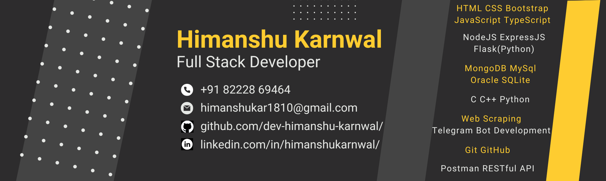

<h1 align="center">Hello, I'm Himanshu</h1>
<h3 align="center">A passionate Full Stack Web developer specializing in <b>Backend and Databases</b>🖥️</h3>

  

- 👯 I’m looking to collaborate on **full stack projects where I can utilize my backend and Database skills**

- 👨‍💻 Most of my projects are available as [Github Repositories](https://github.com/dev-himanshu-karnwal?tab=repositories)

- 💬 Ask me about **API development, Web development**

- 📄 Know more about me on LinkedIn 🤝 [Open LinkedIn Profile](https://www.linkedin.com/in/himanshukarnwal)

- 📞 Call and Whatsapp: **+91 82228 69464**
 
- 📧 Mail ID: **himanshukar1810@gmail.com**

<h3 align="left">Connect with me:</h3>

<h3 align="left">Languages and Tools:</h3>

  

  

  

  

  

  

  

  

  

  

  

  

  

  

  

  

  

  
  

